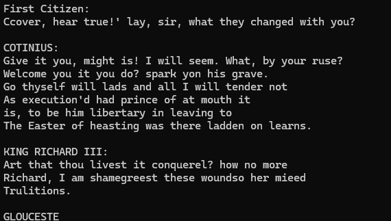
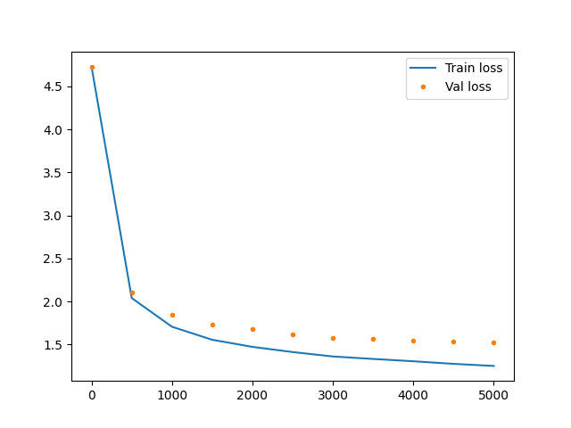
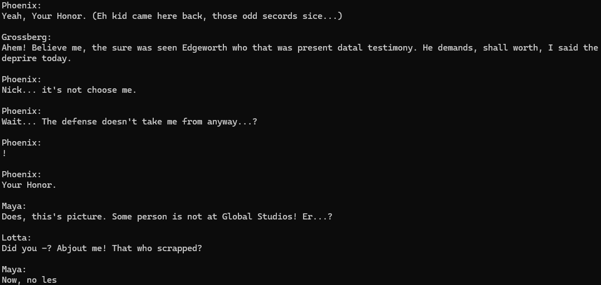
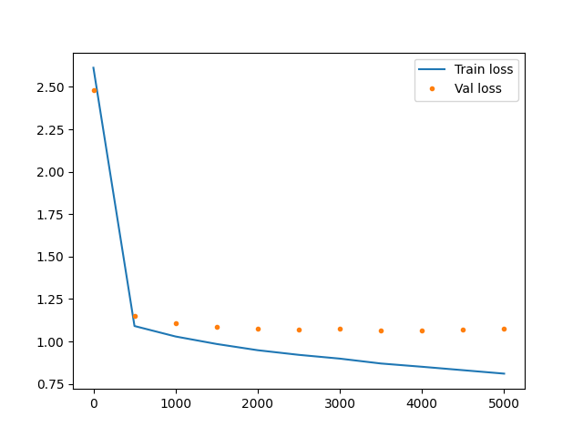

# About this repository

This repository is an implementation of a small LLM using the transformer architecture with a fine-tuning feature. The model was inspired by the tutorial of Andrej Karpathy on the GPT architecture. The tutorial can be found [here](https://www.youtube.com/watch?v=kCc8FmEb1nY).

# About fine-tuning

The fine-tuning is a technique used to adapt a pre-trained model to a specific task/text. The interest of this technique is to gain in performance and/or to reduce the training time. The fine-tuning can be done by freezing some layers of the model. In this repository, you can freeze the attention layers or train the whole model.

# About the model

The model is composed of 6 blocks which contains a multihead attention (6) followed by a single perceptron layer. The model is trained on the tiny shakespeare dataset which contains 111539 characters. The dataset can be found [here](https://raw.githubusercontent.com/karpathy/char-rnn/master/data/tinyshakespeare/input.txt) and in the file ```input.txt```. Finally, the model is fine-tuned on the Ace Attorney dataset which can be found in the file ```fine_tuning_input.txt```. To train, the model, 5000 epochs were needed.

# About the dataset

The tiny shakespeare dataset is a collection of the works of William Shakespeare. The Ace Attorney dataset is a collection of the dialogues of the visual novel game ```Phoenix Wright: Ace Attorney```.

# The results of the model

With 5000 epochs, a window context of 384 characters and a batch size of 32, the model was able to generate the following text on the tiny-shakespeare dataset:



And the history of the loss is the following:



After fine-tuning the model on the Ace Attorney dataset, the model was able to generate the following text with the same prompt as before:



And the history of the loss is the following:



# How to use this repository

To run the model, you can use the following command:

```python
python bigram.py
```

You need to have a python interpreter installed to run it and the library pytorch. The installation of pytorch greatly depends of the configuration of your machine. You can find the installation instructions [here](https://pytorch.org/get-started/locally/).

Also note that a GPU is strongly advised to run this model. An NVIDIA GeForce RTX 3050 is able to train and fine-tune the model in approximately 30 minutes.

Finally, to accelerate the fine-tuning process, you can freeze the attention layers by adding the argument "--freeze" in the command line. The command line would look like this:

```python
python bigram.py --freeze
```